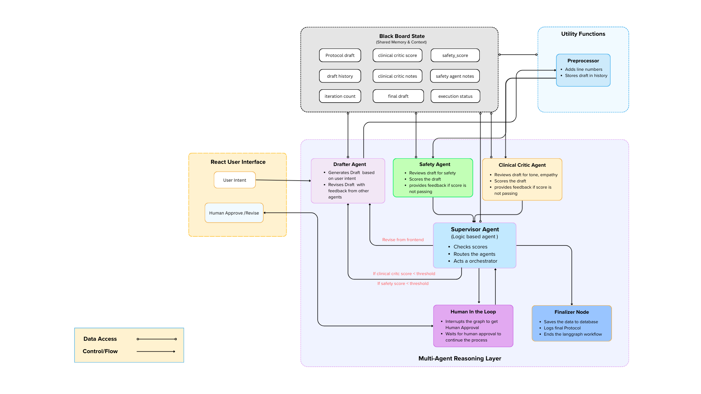

# CBT Foundry

CBT Foundry is an AI-assisted automated system for drafting, reviewing, and finalizing Cognitive Behavioral Therapy (CBT)–based stress-management protocols.
It uses a multi-agent workflow with supervision, critique, and a human-in-the-loop approval stage to ensure structured, safe, and high-quality outputs.

The system is designed to demonstrate how agent orchestration, iterative refinement, and human oversight can be combined in a production-oriented AI application.

## Key Features

- Multi-agent workflow (drafter, critics, supervisor)
- Iterative revision and feedback loop
- Human-in-the-loop review and approval
- Clear separation between backend logic and frontend UI
- Designed for extensibility and real-world deployment patterns

# Architecture(Simplified)




## Project Structure
```
cbt-foundry/
├── backend/
│   └── backend_app/
│       ├── agents/        # Drafter, critics, supervisor agents
│       ├── core/          # Graph orchestration and state management
│       ├── services/      # MCP server and external interfaces
│       ├── shared/        # Shared state and schemas
│       ├── main.py        # Backend entry point
│       └── requirements.txt
│
├── frontend/
│   └── cerina-foundry-app/
│       ├── src/           # React components and hooks
│       ├── public/        # Static assets
│       └── package.json
│
├── .env.example
└── requirements.txt
```
## Tech Stack

Backend
- Python
- LangGraph
- FastAPI
- SSE (Server Sent Events)
- SQLite (for checkpoints and state)
- MCP-compatible service interface

Frontend
- React
- Tailwind CSS
- Component-driven UI for protocol drafting and review

## How It Works

1. The user provides an intent or request for a CBT protocol.
2. A drafting agent generates an initial protocol.
3. Critic agents evaluate the draft and provide structured feedback.
4. A supervisor agent decides whether revision is needed or the draft can proceed.
5. During human review, the draft can be edited, approved, or sent back for revision.
6. Approved protocols are finalized and stored.

## How to Run

Backend
```
cd backend/backend_app
python -m venv venv
source venv/bin/activate   # On Windows: venv\Scripts\activate
pip install -r requirements.txt
python main.py
```
The backend will start the agent workflow and expose the required endpoints and services.

Frontend
```
cd frontend/cerina-foundry-app
npm install
npm start
```
The React app will be available at:
```
http://localhost:3000
```
## Environment Variables

Copy the example file and adjust as needed:
```
cp .env.example .env
```
Add API keys or configuration values required by the backend services.

## Notes

- This project is intended for research, demonstration, and educational purposes.
- It does not provide medical diagnosis or treatment.
- Human oversight is a core design principle of the system.

## License
```
MIT License (NOT ALLOWED(FULLY/PARTIALLY) FOR COMMERCIAL REPRODUCTION)
```
